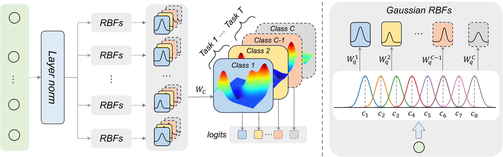

##  KAC: Kolmogorov-Arnold Classifier for Continual Learning
PyTorch code for the CVPR 2025 Highliaght paper:\
**KAC: Kolmogorov-Arnold Classifier for Continual Learning**\
*Yusong Hu, Zichen Liang, Fei Yang, Qibin Hou, Xialei Liu and Ming-ming Cheng*\
IEEE/CVF Conference on Computer Vision and Pattern Recognition (CVPR), 2025 Highlight\
[[paper]]

<p align="center">

</p>

## Setup and Datasets Preparation
Please following the setup steps in [CODA-Prompt]
### Setup
 * Install anaconda: https://www.anaconda.com/distribution/
 * set up conda environment w/ python 3.8, ex: `conda create --name coda python=3.8`
 * `conda activate coda`
 * `sh install_requirements.sh`
 * <b>NOTE: this framework was tested using `torch == 2.0.0` but should work for previous versions</b>
 
### Datasets
 * Create a folder `data/`
 * **CUB200**: retrive from: https://www.kaggle.com/datasets/cyizhuo/cub-200-2011-by-classes-folder
 * **ImageNet-R**: retrieve from: https://github.com/hendrycks/imagenet-r
 * **DomainNet**: retrieve from: http://ai.bu.edu/M3SDA/

## Training
All commands should be run under the project root directory. **The scripts are set up for 4 GPUs** but can be modified for your hardware.

```bash
sh experiments/cub.sh
sh experiments/imagenet-r.sh
sh experiments/domainnet.sh
```

The methods ( L2P, Dual-Prompt and CODA-Prompt ) with a linear classifier and with KAC will be evaluated.

## Results
Results will be saved in a folder named `outputs/`. To get the final average accuracy, retrieve the final number in the file `outputs/**/results-acc/global.yaml`

## Citation
**If you found our work useful for your research, please cite our work**:
    
    @inproceedings{hu2025kac,
    title={Kac: Kolmogorov-arnold classifier for continual learning},
    author={Hu, Yusong and Liang, Zichen and Yang, Fei and Hou, Qibin and Liu, Xialei and Cheng, Ming-Ming},
    booktitle={Proceedings of the Computer Vision and Pattern Recognition Conference},
    pages={15297--15307},
    year={2025}
    }

## Thanks
The code is developed based on [CODA-Prompt], and the implementation of KAC follows [Fast-KAN].

[paper]: https://openaccess.thecvf.com/content/CVPR2025/papers/Hu_KAC_Kolmogorov-Arnold_Classifier_for_Continual_Learning_CVPR_2025_paper.pdf

[CODA-Prompt]: https://github.com/GT-RIPL/CODA-Prompt

[Fast-KAN]: https://github.com/ZiyaoLi/fast-kan